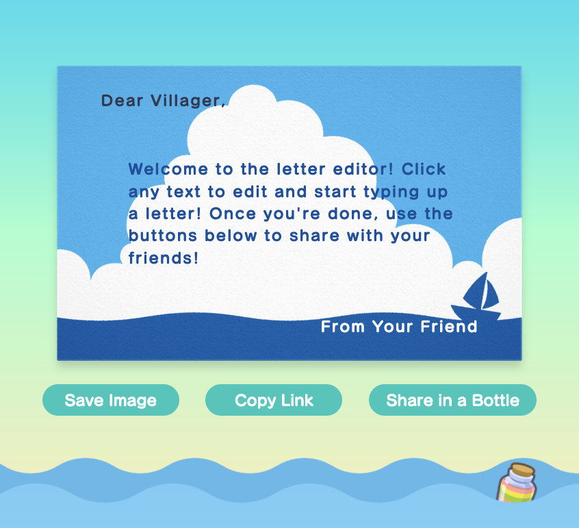

# Animal Crossing Letter Generator

## [`Check it out here!`](https://acmail.idreesinc.com)
 

A pixel-perfect editor for creating the letters from Animal Crossing New Horizons!

*Notice: This project is not affiliated with Animal Crossing or Nintendo in any way and is exclusively a fan project. The open source license does not apply to the names, assets, fonts, or characters used in this project.*

## Features

- Choose from 30+ different stationary designs, including seasonal cards
  - I've carefully recreated every single card from the game, including the seasonal ones!
- Perfectly replicates the in-game letter editor
  - Fonts, colors, aspect ratios and layouts are all accurate to Animal Crossing New Horizons
- Edit text directly on the card with a live preview
  - What you see is what you get!
- Download your letter as a high quality image or share directly via link
  - Share your letter with friends or even with the world using the "Share in a Bottle" feature!
 
---

### [`Share your creations and beta test via the Discord!`](https://discord.gg/6yxE9prcNc)
